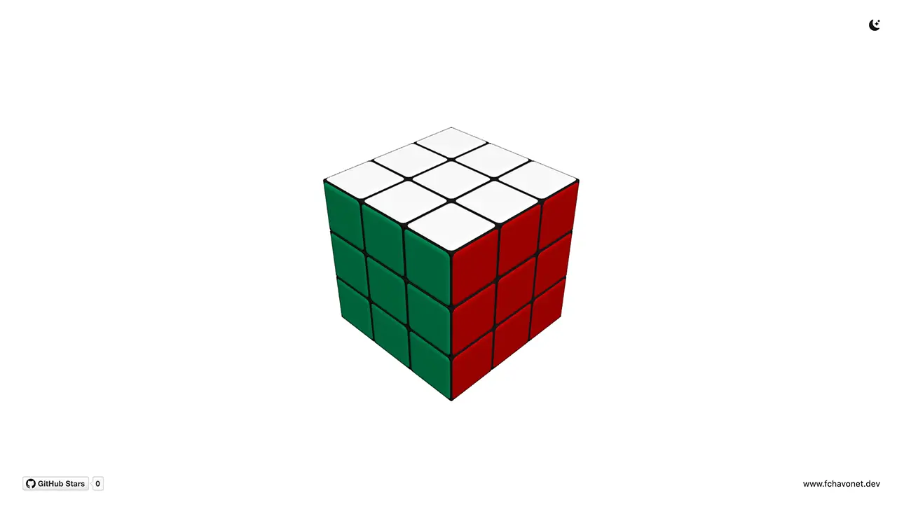

# Rubik's Cube

## Description

This project is a fully interactive 3D virtual Rubik’s Cube built for the web using Three.js.

The initial goal was simple: recreate a Rubik’s Cube that feels realistic, functional, and satisfying to manipulate, inspired by a genuine appreciation for this iconic mechanical puzzle.

The cube can be rotated using both mouse gestures and keyboard controls, with smooth animations, physical inertia, and accurate layer rotations.

## Objectives

- Recreate a fully functional Rubik’s Cube in a 3D environment.
- Implement intuitive mouse-based layer rotations.
- Support classic keyboard controls (R, L, U, D, F, B).
- Ensure precise rotations with clean alignment after each move.
- Build a visually pleasing and responsive 3D scene.
- Explore advanced interaction logic with Three.js and raycasting

## Tech Stack


## File Description

| **FILE**     | **DESCRIPTION**                                                          |
| :----------: | ------------------------------------------------------------------------ |
| `assets`     | Contains the resources required for the repository.                      |
| `index.html` | HTML structure and UI layout of the project.                             |
| `style.css`  | Global styles, DaisyUI configuration, and visual tweaks.                 |
| `script.js`  | Core logic: Three.js scene, cube generation, interactions, and controls. |
| `README.md`  | The README file you are currently reading 😉.                            |

## Installation & Usage

### Installation

1. Clone this repository:
    - Open your preferred Terminal.
    - Navigate to the directory where you want to clone the repository.
    - Run the following command:

```
git clone https://github.com/fchavonet/creative_coding-rubiks_cube.git
```

2. Open the cloned repository.

### Usage

1. Open the `index.html` file in your web browser.

2. Interact with the cube:
- Click and drag on a cube face to rotate a layer.
- Use the mouse to orbit around the cube.
- Use the keyboard to rotate faces:
    - R, L, U, D, F, B
    - Hold Space to invert the rotation direction.

You can also test the project online by clicking [here](https://fchavonet.github.io/creative_coding-rubiks_cube/).

<p align="center">
    <picture>
        <source media="(prefers-color-scheme: light)" srcset="./assets/images/screenshots/desktop_page_screenshot-light.webp">
        <source media="(prefers-color-scheme: dark)" srcset="./assets/images/screenshots/desktop_page_screenshot-dark.webp">
        
    </picture>
</p>

## What's Next?

- Add an on-screen controls menu explaining mouse and keyboard interactions.
- Implement a Shuffle button to randomize the cube state.
- Implement a Solve / Reset button to restore the cube to its original state.

## Thanks

- A big thank you to my friends Pierre and Yoann, always available to test and provide feedback on my projects.

## Author(s)

**Fabien CHAVONET**
- GitHub: [@fchavonet](https://github.com/fchavonet)
